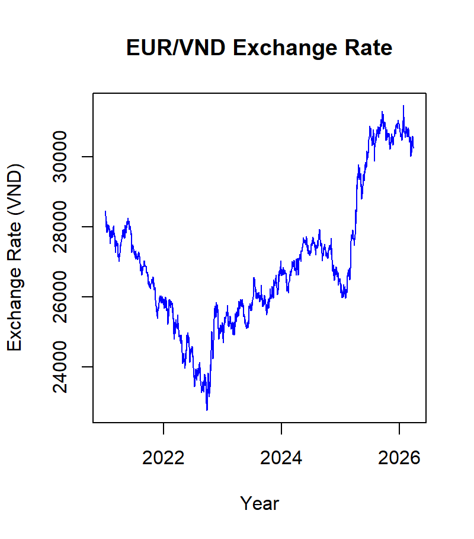
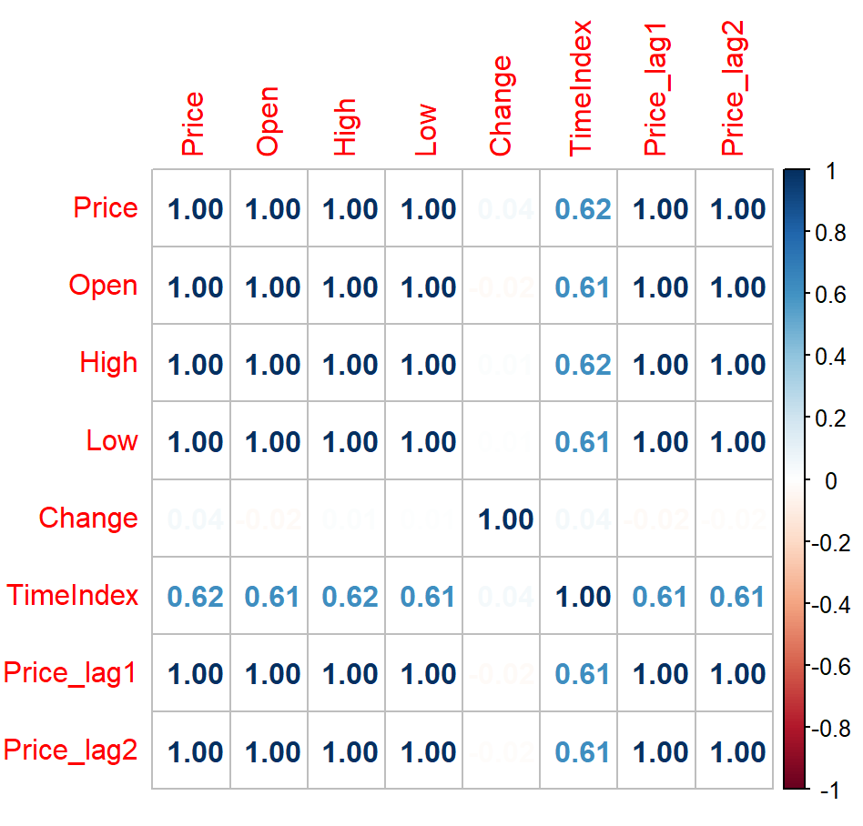

# Introduction

This project creates and compares two regression models - Multiple Linear Regression (MLR) and Autoregressive Regression (AR) to forecast Foreign Exchange rate (FX), then performs a Principal Component Analysis (PCA) to find most important variables. Historical FX data from January 1, 2021 to March 30, 2026 was collected from Investing.com, a financial platform offering real-time data of the FX market, stock prices, etc.

## Data

The original dataset (`EUR_VND.csv`) includes 7 attributes, 1,368 instances:
   - Date
   - Price: conversion rate
   - Open: rate at the beginning of the transaction day
   - High: highest rate in a day
   - Low: lowest rate in a day
   - Volume: number of transactions made by users
   - Change: percentage of variation compared to a spot rate

## Methodology and Calculations

1. **Data Cleaning** (`CA1_DataCleaning.R`)
   - Remove Volume variable: Volume only showcases number of transactions on a certain platform, not globally.
   - Transform Price, High, Low, Open variables into numeric by removing the comma, as R interprets a value with comma “30,000” as character, not as numeric type.
   - Remove percentage sign of the Change attribute.
   - Transform Date into time series data.
   - Feature engineering: Add time index, previous day’s price (Price_lag1), two days before’s price (Price_lag2).
   - Remove rows with null values.
   - Exports the cleaned dataset to `data/clean_data.csv`

2. **Descriptive Statistics**

The analysis focuses primarily on the Price (*M* = 26,984, *SD* = 1988.87) as the target variable. Over 5 years, the equivalent worth to 1 EUR in VND reached the bottom at 22,762 VND and peaked at 31,469 VND. It fluctuated sharply from -1.96% to +2.55%.


*Fig. 1. EUR/VND conversion rate from 2021 – 03/2026. Price dropped sharply from 06/2021 – 09/2022. After that, the conversion rate tended to increase despite some setbacks.*


*Fig. 2. Correlation matrix of variables. The OHLC variables are greatly correlated with each other. Meanwhie, Change variable does not correlate with any and TimeIndex exhibits a strong correlation with all OHLC attributes.*

2. **Data Mining** (`CA1_DataMining.R`)
   - **Autoregressive (AR) Model**: A linear predictive modeling technique based on previous signal samples. Previous signals in this study are (a) previous day’s Price and (b) two days ago’s Price.
   - **Multiple Linear Regression (MLR)**: Built based on OHLC attributes, lagged variables, and time index. The Change variable was excluded as it shows no correlation with Price. 
   - **Principal Component Analysis (PCA)**: Reduces dimensionality of the dataset and address multicollinearity as highlighted by descriptive statistics results.

3. **Results**


## Requirements

This project uses R and the following packages:

```r
install.packages(c("readr", "dplyr", "tidyr", "tsibble", "lubridate", "here", "ggplot2", "corrplot", "feasts"))
```

## How to Run

1. Clone the repository:
   ```
   git clone https://github.com/aquarius2101/EUR-VND-Forex-Data-Analysis.git
   ```
2. Open `EUR-VND-Forex-Data-Analysis.Rproj` in RStudio (this sets the project root correctly for the `here` package).
3. Install the required packages listed above.
4. Run `Scripts/CA1_DataCleaning.R` first to produce the cleaned dataset.
5. Run `Scripts/CA1_DataMining.R` to build the models and generate the plots.

## Output

Running the scripts produces cleaned data (`data/clean_data.csv`) and a set of diagnostic and exploratory plots, including residual plots for the AR and MLR models, a correlation matrix, and PCA scree/component plots. Output of the machine learning models are also shown in the environment of RStudio.

## Author

Hong Nhung Nguyen
